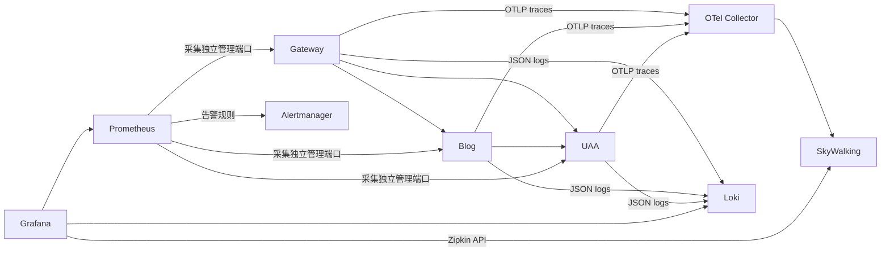

# Blog、UAA、Gateway 本地可观测性

使用 Spring Boot 4 原生 Micrometer / OpenTelemetry，一套 SDK 统一传播 W3C
`traceparent`。Gateway 在 WSL 运行，Blog、UAA 在 Windows 运行，方便 IDEA 附加调试。
Blog 的 UAA 认证配置、令牌刷新与撤销客户端使用 Spring 配置的 `RestClient.Builder`，
保留跨服务追踪上下文。



指标使用 Prometheus，日志使用异步 Loki4j，Grafana 的 **Kuma / Kuma Services**
面板展示三服务采集状态、流量、5xx 比例、P95、JVM 堆内存、数据库连接与关联日志。
Loki 的 `traceId` 字段链接到 SkyWalking Zipkin 数据源；调用链也能反查日志。
日志标签只使用服务名和环境，traceId 保留在 JSON 中；访问日志不记录请求体、
Authorization、Cookie 或查询参数值。默认采样 10%，验证使用明确采样的父 trace。

SkyWalking 当前接收 OTLP 并转换为 Zipkin traces，使用其 Zipkin Trace/Lens 页面或
Grafana Zipkin 数据源查询。此方案覆盖 HTTP 服务链，不等同于 SkyWalking 原生
Agent 的完整拓扑、方法或 SQL 自动探针；数据库连接池指标由 Micrometer 提供。

## 启动

确保 WSL 中间件、Collector、SkyWalking 和本目录监控组件已经就绪。
Nacos 使用 `base` 命名空间、`DEFAULT_GROUP`，配置环境仍为 `dev`。
Blog 与 UAA 需配置各自的 `bootstrap-local.yml`，本地 OAuth issuer 为
`http://localhost:33336`。`KUMA_CONFIG_PROFILE=dev` 使两个 active profiles
仍读取正确的 Nacos 文件，启动脚本通过命令行覆盖 Nacos 中的观测开关。

```powershell
# 更新本地监控配置；首次部署参考 README.md。
wsl -d Ubuntu-24.04 -u root -- kubectl apply -k /mnt/d/IDEA_project/KumaFramework/k8s/local/monitoring
wsl -d Ubuntu-24.04 -u root -- kubectl -n base rollout restart statefulset/grafana
wsl -d Ubuntu-24.04 -u root -- curl --noproxy localhost -X POST http://localhost:9090/-/reload

# Windows 启动 UAA 与 Blog。已构建时省略 -Build；更新运行实例使用 -Restart。
powershell -NoProfile -ExecutionPolicy Bypass -File scripts/start-services-local.ps1 -Build -Restart

# Gateway 已构建、已运行时无需重复启动。
wsl -d Ubuntu-24.04 -u root -- bash /mnt/d/IDEA_project/KumaFramework/scripts/start-gateway-observability-wsl.sh

# 验证真实三服务链、日志、调用链、指标、鉴权、面板与数据源。
wsl -d Ubuntu-24.04 -u root -- python3 /mnt/d/IDEA_project/KumaFramework/scripts/check-services-observability-wsl.py
```

ConfigMap 更新投射到 Prometheus 容器可能需要短暂等待，reload 后可从
`/api/v1/rules` 检查是否包含 `ServiceHighErrorRate` 和 `ServiceHighLatency`。
验证请求使用 Blog 的认证配置接口，其本地缓存为 30 秒；重复验证前等待缓存过期。

| 服务 | 业务端口 | 管理端口 | IDEA 调试端口 |
|---|---:|---:|---:|
| Gateway（WSL） | 18080 | 18081 | — |
| Blog（Windows） | 9000，context `/api` | 19001 | 5005 |
| UAA（Windows） | 33336 | 19002 | 5006 |

Blog/UAA 的管理接口仅绑定 Windows 的 WSL NAT 网卡，不绑定外部网卡；
Gateway 的管理端口沿用 WSL 配置。管理端口只开放 health、info、prometheus，
业务端口拒绝 prometheus。启动脚本将 Windows 地址注册为 K3s EndpointSlice，
供集群内 Prometheus 采集；WSL IP 变化时重新运行脚本。
调试端口只绑定 `127.0.0.1`，可用 `-BlogDebugPort 0 -UaaDebugPort 0` 关闭。

运行 jar 按 SHA256 复制到 `logs/<服务>-local/runtime/`，避免构建替换正在运行的 jar。
PID 和日志在 `logs/<服务>-local/`。脚本只会停止自己记录且命令行匹配的 Java 实例，
不接管其他端口占用进程。当前支持 WSL NAT 网络。

## 查看结果

- Grafana 三服务面板：http://localhost:3000/d/kuma-services
- Gateway 专属面板：http://localhost:3000/d/kuma-gateway
- SkyWalking：http://localhost:12880
- Prometheus：http://localhost:9090
- Alertmanager：http://localhost:9093

服务连续两分钟失联触发 `MonitoringTargetDown`；持续五分钟 5xx 超过 5% 或
P95 超过两秒触发服务告警。Alertmanager 当前使用本地空接收器，页面可查看告警，
外部邮件或聊天通知渠道仍需配置。

参考：[Spring Boot tracing](https://docs.spring.io/spring-boot/4.0/reference/actuator/tracing.html)、
[SkyWalking OTLP traces](https://skywalking.apache.org/docs/main/v10.2.0/en/setup/backend/otlp-trace/)、
[Grafana Zipkin](https://grafana.com/docs/grafana/latest/datasources/zipkin/)。
