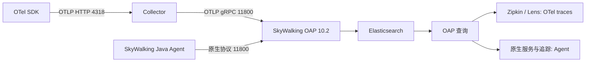

# OTel 与 SkyWalking 实验

这组实验按“产生证据 → 解释证据 → 到后端查回”学习。前面的本地对照使用模拟库存与支付；
第9节在你的真实 PostgreSQL/MySQL 实例里创建独立实验命名空间，执行真实 SQL 和事务。
从仓库根目录运行 Gradle 命令，使用 JDK 25。Linux/WSL 将 `./gradlew.bat` 换成 `./gradlew`。
独立 main 不需要启动 Spring、Nacos 或业务中间件；首次构建需要下载依赖。

## 1. 先理解职责

| 组件 | 做什么 | 在实验中如何观察 |
| --- | --- | --- |
| OTel API | 定义 span、counter、histogram、日志等操作 | 查看 `spanBuilder`、`counterBuilder`、`logRecordBuilder` |
| OTel SDK | 创建 ID、记录数据、采样、聚合并调用 exporter | 查看报告的 spans、metrics、logs 和 checks |
| Propagator | 将上下文注入/提取协议载体 | 查看 `traceparent` 与远端 parentSpanId |
| OTLP exporter | 把遥测发送到接收端 | 在线模式把 trace 发到 4318 |
| Collector | receiver 接收，processor 处理，exporter 转发 | 查看 `k8s/base/observability.yaml` 的 traces pipeline |
| SkyWalking Java Agent | 增强受支持的框架与库，产生原生遥测 | `-javaagent` 前后对比，toolkit 自定义 span |
| SkyWalking OAP | 接收、分析并写入存储，提供查询 API | 按 trace ID 查回，查看原生服务指标 |
| SkyWalking UI | 展示服务、实例、端点、拓扑与追踪 | OTel 走 Zipkin/Lens；Agent 走原生追踪 |

OTel 提供可移植的遥测标准与组件；SkyWalking 是带 Agent、分析后端和界面的 APM 平台。
可以组合使用：本仓库的 OTel SDK → Collector → OAP 就是一条组合路径。
OTel SDK 与 SkyWalking Agent 的上下文协议和 ID 不会因为在同一进程中就自动互通。



## 2. 本地 OTel：三个信号与一条 trace

```powershell
./gradlew.bat :kuma-project:kuma-project-lab:otelLab --console=plain
```

或在 IDE 运行 `com.kuma.cloud.lab.observability.OtelLearningDemo.main()`。
实验使用真实 SDK 与内存 exporter，不只是拼出一份 JSON。每次创建独立 SDK，退出时关闭；不注册全局 SDK，不替换 Lab 应用已有的 tracer。

预期输出 `backendStatus=LOCAL_ONLY`，所有 `checks` 为 true。

### Trace、span 与资源

Trace 表示一次完整调用过程；span 表示其中一个操作。关联 span 共用 traceId，每个 span 有自己的 spanId，parentSpanId 表示父操作。
报告含七个已结束 span，其中六个属于 checkout 链路，一个是故意断开的异步任务：

```text
checkout [SERVER, ERROR]
├─ inventory.call [CLIENT]
│  └─ inventory.receive [SERVER]
│     └─ inventory.lookup [INTERNAL, 模拟 40ms 延迟]
├─ async.with-context [INTERNAL]
└─ payment.failure [INTERNAL, ERROR, exception 事件]

async.without-context [独立 trace，parentSpanId 全零]
```

报告按 span 结束顺序输出，通常子 span 在父 span 前面；用 ID 关系还原树，不能把数组顺序当成调用顺序。
Resource 的 `service.name=kuma-lab-otel` 标识数据属于哪个服务；span attribute 描述具体操作。
`durationMs` 来自 SDK 时间戳，线程调度会影响实际值，40ms/200ms 是模拟等待，不是数据库性能测试。

### Context 与 W3C traceparent

`makeCurrent()` 让当前线程知道正在执行哪个 span，Scope 关闭时恢复之前的 Context。
传播实验将 CLIENT 上下文注入一个 header Map，再由模拟服务端提取并创建 SERVER span。
这是协议载体实验，没有实际 HTTP 远程调用；已验证 SDK 的 W3C inject/extract 行为。

`traceparent` 的格式是 `00-<32位traceId>-<16位父spanId>-<flags>`。
本实验 flags 为 `01`，表示 sampled。检查 inventory.receive 的 parentSpanId 是否等于 inventory.call 的 spanId。
跨进程必须由框架插件或你自己的代码传递 header；仅使用相同 service.name 无法关联 trace。

### 异步断链与修复

普通 Executor 不保证继承提交线程的 OTel Context。
第一份任务直接创建 span，得到独立 trace；第二份任务使用 `Context.current().wrap(...)`，回到 checkout 链路。
对比 `asyncContextLost`、`asyncContextRestored` 和对应 ID。
生产环境的自动增强可能已经传播线程上下文；该实验使用独立 SDK 和显式传播演示机制。

### 异常与慢调用

`recordException()` 添加 exception 事件；`setStatus(ERROR)` 设置错误状态。二者分别执行，不能假定记异常就自动变成 ERROR。
payment.failure 两者都有，checkout 也被标记 ERROR。
在时间线中找到 inventory.lookup 的耗时，而不是仅看 checkout 的总耗时。日志还能解释失败的具体原因。

### Metrics 与 Logs

| 信号 | 本实验输出 | 回答的问题 |
| --- | --- | --- |
| Trace | span 树、耗时、ERROR、exception | 哪条请求在哪一步变慢或失败？ |
| Metric | `lab.checkout.requests` LONG_SUM=1；`lab.checkout.duration` HISTOGRAM | 请求累计多少、耗时如何分布？ |
| Log | INFO 启动日志与 ERROR 支付日志，带有效 traceId/spanId | 某时刻发生了什么，属于哪条请求？ |

counter 的 outcome 标签是低基数值；不要给每个订单号或 traceId 建 metric label，会创建大量时间序列。
histogram 输出的 values 是本次累计耗时 sum，不是 p95；一个样本无法代表线上延迟分布。
本实验使用 SDK 日志 API，显式设置 Context 来关联日志；普通 SLF4J/System.Logger 不会因此自动进入 OTel log pipeline。

### 采样

`sampledSpans` 输出：alwaysOn=2、alwaysOff=0、parentBased-unsampled=0。
每组创建一个根 span 和一个子 span；parentBased 的根采样器为 alwaysOff，子 span 跟随未采样父级。
未采样仍可能有可传播 ID，但不会向 span exporter 输出记录；ID 存在不代表后端必定查得到。
采样发生在 span 创建时，后续 ERROR 无法“补回”已经被头部采样丢弃的 span。
概率采样比例是统计趋势，不能断言每十条正好保留一条；这里使用确定性策略便于检查。
Collector 尾部采样可在收到完整或足够的 trace 后按错误/耗时筛选，但需要缓存和一致路由；本仓库当前没有 tail_sampling processor。

## 3. 在线 OTel：发到 Collector，再从 SkyWalking 查回

先按 [部署说明](../../../k8s/OBSERVABILITY.md) 确认本地 WSL 的四个组件正常，开启已有转发服务：

```powershell
wsl -d Ubuntu-24.04 -u root -- bash /mnt/d/IDEA_project/KumaFramework/scripts/expose-observability-wsl.sh
./gradlew.bat :kuma-project:kuma-project-lab:otelLab -PotelExport=true --console=plain
```

已有转发服务正常时可直接运行第二条命令。自定义地址示例：

```powershell
./gradlew.bat :kuma-project:kuma-project-lab:otelLab -PotelExport=true "-PotelEndpoint=http://localhost:4318/v1/traces" "-PskywalkingQuery=http://localhost:9412"
```

程序最多轮询约90秒，按 traceId 查询 `/zipkin/api/v2/trace/<id>`，确认同一 trace 的六个 span ID 全部存在才输出
`VERIFIED_IN_SKYWALKING`。连接失败、span 不完整或查不到会使任务失败，不把本地检查通过当成后端成功。
故意断开的 async.without-context 使用另一条 trace，可按报告里的独立 ID 查询。

打开 http://localhost:12880，进入 Zipkin Trace/Lens 查询页，选择 `kuma-lab-otel`，使用报告 traceId 或最近时间窗口搜索。
依次验证六个 span 的父子关系、模拟慢库存操作、payment 的 exception 和 ERROR 对应的 Zipkin tags。
SkyWalking 10.2 会将 OTLP trace 转为 Zipkin 格式，转换后的展示与 SDK 原始字段可能不同。

现有 Collector 只启用 traces pipeline。metrics/logs 仍由本地 SDK exporter 捕获，这次不会送入 SkyWalking。
接收端开了4317/4318不代表所有信号都已接通；要接入 metrics/logs，需要对应 Collector pipelines 和后端接收/分析规则。
OTel/Zipkin trace 的查询成功也不代表已经拥有原生 Agent 的服务拓扑、端点指标和告警。

## 4. SkyWalking Toolkit：不挂 Agent 的对照

```powershell
./gradlew.bat :kuma-project:kuma-project-lab:skywalkingLab --console=plain
```

输出 normal、slow、error 三个场景：SUCCESS、SUCCESS、SIMULATED_FAILURE。
没有 Agent 时 `activeTrace=false`，通常 traceId 为 `Ignored_Trace`。这说明 toolkit 是增强入口，依赖本身不提供后台采集。
slow 在 inventory 等待200ms；error 在 payment 抛出模拟异常，checkout 捕获并用 `ActiveSpan.error()` 标记。

## 5. 挂载 SkyWalking Agent：原生 trace 对照

使用 Apache 官方完整 Java Agent 包，保留 config、plugins、activations 等目录，不能只拷贝 agent jar。
JDK25 可用 Agent 9.6+ 的受支持版本；本实验独立 main 可以避开 Spring 插件兼容性问题。
LabApplication 使用 Spring Boot4，HTTP 自动采集另需 Agent 支持 Boot4/Tomcat11 的插件，核对对应发布版本支持列表。

```powershell
./gradlew.bat :kuma-project:kuma-project-lab:skywalkingLab "-PskywalkingAgent=D:/tools/skywalking-agent/skywalking-agent.jar" "-PskywalkingBackend=localhost:11800" --console=plain
```

任务自动设置 service_name=kuma-lab-skywalking、全量 Agent 采样与 keep_tracing=true，
并启用 `--require-agent`：没有有效 native trace 就失败。keep_tracing 让启动连接尚未就绪时仍产生 trace，
不代表离线期间的数据一定能成功发送；这些设置仅用于这个独立教学进程。
观察三个报告各自的 traceId 和 elapsedMs。用原生追踪页面按 ID 查回，比较
`lab.skywalking.checkout → inventory / payment`、inventory 的慢 span 和 payment 的错误。
`activeTrace=true` 只证明当前方法已增强，不能证明 OAP 已收到；程序留5秒给周期上报，但最终仍以查询结果为准。
程序在场景开始前也等待3秒建立初始连接。如果使用本机已准备的 Agent，路径参数可直接写为
`-PskywalkingAgent=build/tools/skywalking-agent/skywalking-agent.jar`（相对 lab 模块）。
独立 main 的 toolkit span 属于自定义本地操作，没有自动采集的 HTTP ENTRY/远端 EXIT；不据此断言真实跨服务拓扑或端点吞吐。
日志中显式打印 native traceId 方便关联；该实验没有安装日志上报插件，不能断言这些日志已被 OAP 存储。

也可通过 UI 的 GraphQL 代理核验原生 trace。把报告里的 ID 填入下面的请求：

```powershell
$query = 'query { queryTrace(traceId: "报告里的原生traceId") { spans { endpointName isError startTime endTime } } }'
$body = @{query=$query} | ConvertTo-Json
Invoke-RestMethod -Uri http://localhost:12880/graphql -Method Post -ContentType application/json -Body $body
```

每条应查回三个 span；slow 的 inventory 时间差约200ms，error 的 checkout/payment 的 isError=true。
首条查不到时检查 Agent 连接日志并重跑；有效本地 ID 不构成持久化证明。

## 6. 在 lab 控制台发起实验

启动 LabApplication 后，控制台实验场中可搜索“OTel 与 SkyWalking 学习”。

| 请求（经过 `/api` 前缀） | 观察内容 |
| --- | --- |
| GET `/api/lab/observability/guide` | 路线与现有管道边界 |
| POST `/api/lab/observability/otel` | 本地 SDK 五类实验的报告和断言 |
| POST `/api/lab/observability/skywalking/normal` | 正常库存与支付 |
| POST `/api/lab/observability/skywalking/slow` | 库存模拟200ms等待 |
| POST `/api/lab/observability/skywalking/error` | 支付模拟异常与错误 span |

给 **LabApplication JVM** 添加 Agent 参数并重启；给 Gradle JVM 挂 Agent 并不等于给应用子进程挂 Agent。

```text
-javaagent:D:/tools/skywalking-agent/skywalking-agent.jar
-Dskywalking.agent.service_name=kuma-cloud-lab-native
-Dskywalking.collector.backend_service=localhost:11800
```

连续请求 normal/slow/error 各20次，在原生 UI 的最近时间窗口观察服务、实例和端点：
1. Trace 时间线：慢场景的库存 span 占明显更长时间。
2. 错误 span：异常日志/标记能定位支付失败。
3. 端点指标：业务异常在本实验被捕获，响应仍为 HTTP200；原生入口成功率取决于 Agent/OAP 的错误归因规则，不能把它当成 HTTP500 实验。
4. JVM/实例指标：受插件和采集周期影响，短时间运行可能尚无完整图表。

一次请求只能证明采集与追踪；吞吐、平均耗时、分位数需要持续流量。
真实拓扑需要被采集的跨服务请求，本实验 inventory 是同进程模拟，不会凭空生成第二个服务节点。
告警需要告警规则及通知端，Profiling 需要任务/插件/运行时支持；部署 OAP/UI 不会自动让这些功能可用。

## 7. Collector 功能与排障练习

打开 `k8s/base/observability.yaml`：
- receiver：OTLP gRPC4317、HTTP4318接收 SDK 遥测。
- memory_limiter：约束 Collector 内存压力；它不是应用 JVM 的内存限制。
- batch：集中发送，减少网络开销，可能使后端出现数据的时间稍有延迟。
- exporter：OTLP gRPC 发往 OAP11800，带内存队列与有界重试。
- Elasticsearch：存储后端；Collector 不是可查询的长期数据库，重启可能丢弃内存排队数据。

可逆排障练习：先关闭本机 Collector 端口转发，再运行在线任务；观察导出/查询失败。
恢复转发后重新执行，确认新 trace 能被查回。不要为了练习停掉共享服务器的 OAP 或删除 PVC。
SDK 教学使用 SimpleSpanProcessor，便于观察即时导出；生产一般采用 BatchSpanProcessor。

| 现象 | 优先检查 |
| --- | --- |
| 本地有 span，UI 无数据 | 是否用了在线模式、采样、地址/协议、Collector exporter、OAP receiver、查询时间窗口 |
| trace 被分成多条 | HTTP header 是否注入/提取、Executor 是否传播 Context、是否混用两个 Agent |
| native ID 无效 | Agent 参数是否进入应用 JVM、toolkit activation、支持版本、采样配置 |
| ID 有效但查不到 | 11800通路、Agent日志、采样/上报、OAP与存储、正确的原生/Zipkin查询页 |
| metric/log UI 空白 | 当前 traces-only 配置没有这两类管道；日志适配器是否真实启用 |
| exporter NoSuchMethodError | SDK/exporter/internal 版本是否混用；lab 使用 Spring Boot BOM 统一管理 |

## 8. 推荐阅读代码顺序与官方资料

先读 OtelLearningDemo 的 run（信号与传播），再读 sample（采样）、verifyBackend（存储验证），
最后读 SkyWalkingLearningDemo 的 @Trace、ActiveSpan 和 TraceContext 调用。
观察报告之后自己修改一次延迟或 span attribute，再跑检查并到 UI 对照。

- [OpenTelemetry Java SDK](https://opentelemetry.io/docs/languages/java/sdk/)：SDK、processor、reader 与 exporter。
- [Context propagation](https://opentelemetry.io/docs/concepts/context-propagation/)：上下文与传播载体。
- [Sampling](https://opentelemetry.io/docs/concepts/sampling/)：头部/尾部采样的取舍。
- [SkyWalking10.2 OTLP traces](https://skywalking.apache.org/docs/main/v10.2.0/en/setup/backend/otlp-trace/)：本仓库版本的 Zipkin 转换路径。
- [SkyWalking Java toolkit](https://skywalking.apache.org/docs/skywalking-java/latest/en/setup/service-agent/java-agent/application-toolkit-trace/)：@Trace、ActiveSpan、TraceContext。
- [Agent9.6安装与JDK支持](https://skywalking.apache.org/docs/skywalking-java/v9.6.0/en/setup/service-agent/java-agent/readme/) 与 [当前插件支持列表](https://skywalking.apache.org/docs/skywalking-java/latest/en/setup/service-agent/java-agent/supported-list/)：实际使用时匹配所选版本。

## 9. 真实 PostgreSQL / MySQL：SQL、慢查询与事务回滚

使用 `DatabaseObservabilityLearningDemo`。PostgreSQL 在现有 database 内建 `kuma_observability_lab` schema；
MySQL 创建同名独立 database（MySQL 的 schema/database 是同一概念）。
所有库存、支付 SQL 都使用完整限定表名；不修改连接 search_path，不改现有业务表。
DDL 使用 IF NOT EXISTS，表不会在重复实验时重建或清空；每次场景生成新的 UUID run_id，历史结果保留供你查阅。

### 一键使用你的 WSL 数据库

在 Windows 仓库根目录运行。脚本读取本地 K3s 现有 Pod 的凭据配置，临时放入子进程环境，
不把密码写进代码、Gradle 参数或实验报告，结束后恢复原进程环境。

```powershell
# PostgreSQL，真实 SQL + OTel 上报并查回所有 span
powershell -NoProfile -ExecutionPolicy Bypass -File kuma-project/kuma-project-lab/scripts/run-observability-database-wsl.ps1 -Export

# PostgreSQL，真实 JDBC + SkyWalking Agent 自动增强
powershell -NoProfile -ExecutionPolicy Bypass -File kuma-project/kuma-project-lab/scripts/run-observability-database-wsl.ps1 -Telemetry skywalking

# MySQL，正常提交、数据库端延迟、约束失败与回滚的真实集成测试
powershell -NoProfile -ExecutionPolicy Bypass -File kuma-project/kuma-project-lab/scripts/run-observability-database-wsl.ps1 -Database mysql -Test
```

省略 `-Export` 时仍真实操作数据库，只把 OTel span 收集到本地。
`-Database mysql -Export` 可将 MySQL 实验 trace 送到 Collector；
`-Database mysql -Telemetry skywalking` 可观察 Agent 对 MySQL JDBC 的自动采集。
Agent 默认路径为 lab 模块下的 `build/tools/skywalking-agent/skywalking-agent.jar`，也可以使用 `-AgentJar` 指定完整安装包中的 jar。
新环境需要先安装官方完整 Agent 包，配置现有 Collector/OAP 转发服务。
脚本默认使用 `Ubuntu-24.04` 的 base 命名空间和 postgresql/mysql 外部 Service；`-Distribution` 可切换 WSL 发行版。
脚本会使用现有 PostgreSQL账号/MySQL root 账号；在 Lab 应用中则使用你配置的数据源账号，需要创建实验命名空间/表的权限。

### 手动指定连接

独立 main 读取三个环境变量：

```powershell
$env:KUMA_LAB_OBSERVABILITY_JDBC_URL = 'jdbc:postgresql://localhost:5432/你的现有数据库'
$env:KUMA_LAB_OBSERVABILITY_JDBC_USER = '你的用户'
# 密码请通过本机安全的环境变量/凭据方式提供：KUMA_LAB_OBSERVABILITY_JDBC_PASSWORD
./gradlew.bat :kuma-project:kuma-project-lab:otelDatabaseLab -PotelExport=true
```

MySQL URL 也可连接现有 database，实际读写仍完全限定到 `kuma_observability_lab`；
或使用 `jdbc:mysql://localhost:3306/?useSSL=false&allowPublicKeyRetrieval=true` 连接本机实例。
不要将密码放进 URL；报告不输出 JDBC URL/用户/密码。

### 三个场景各自产生什么证据

每个场景首先插入属于自己 run_id 的库存行 stock=10，然后开始真正的 JDBC 事务：

| 场景 | 事务中的真实操作 | 提交/回滚后重新查询的结果 |
| --- | --- | --- |
| normal | SELECT库存；UPDATE库存-1；INSERT支付100；COMMIT | stock=9、payments=1 |
| slow | 增加 SELECT pg_sleep(0.2) / SLEEP(0.2)，其余正常提交 | stock=9、payments=1；慢 SQL 耗时约200ms |
| error | 扣库存、插入支付，再插入同一主键引发数据库约束错误；ROLLBACK | stock=10、payments=0 |

慢操作由数据库服务器执行，不再使用 Java Thread.sleep；它演示数据库等待，不代表真实索引/执行计划问题。
error 不是手动抛一个 Java异常：PostgreSQL 返回 SQLSTATE23505，MySQL 返回23000；
事务内库存扣减和首次支付写入都必须回滚。非预期 SQL 错误会终止实验，不当作预期成功。
建 schema/table 与 seed 在业务事务之前完成，库存初始行有意保留；
MySQL DDL可能隐式提交，因此不能混在要演示回滚的事务里。
所有 SQL 设置5秒 query timeout，连接助手也配置连接/读取超时。

### OTel 与 Agent 的实际区别

OTel 实验**手动**给每条 SQL 包一层 CLIENT span，记录真实耗时、`db.system.name`、`db.namespace`、
`lab.db.schema`、参数化 `db.query.text`；绑定的 run_id 不填进 SQL span attribute。
PostgreSQL 的 db.namespace 是连接的 database，lab.db.schema 才是独立 schema；MySQL的 db.namespace 为独立实验 database。
SQL错误 span 有 ERROR与exception，根 span 有 transaction.rollback事件。
normal 共6个 span，slow/error 各7个；在线命令按 ID查回所有 span 后才显示 VERIFIED_IN_SKYWALKING。
HTTP实验接口只返回 EXPORT_ATTEMPTED_NOT_YET_QUERIED，不把 SDK forceFlush当成存储成功。

Agent实验不启动 OTel span 采集，由 SkyWalking JDBC插件自动记录 PostgreSQL/MySQL的
Statement/PreparedStatement、commit、rollback 等调用，外层 @Trace 补充实验场景。
在原生 UI 查看 JDBC span 的 SQL tags、耗时和错误；关注 error 中的重复 INSERT及 rollback。
设置 autoCommit 时，驱动/Agent可能产生额外 commit记录；不能仅看 span名字的数量判断支付成功。
报告中的真实查询结果才是事务是否完整回滚的证据。
自动 JDBC插件会发现数据库依赖，具体拓扑展示取决于 OAP分析规则；这个独立 main 不提供 HTTP吞吐指标。

### 用数据库客户端对照

每份报告都有 runId。把它填到下面的参数位置，在数据库客户端查询：

```sql
SELECT run_id, stock
FROM kuma_observability_lab.inventory
WHERE run_id = '报告里的runId';

SELECT run_id, receipt_id, amount
FROM kuma_observability_lab.payments
WHERE run_id = '报告里的runId';
```

normal/slow有1条支付，error没有支付。数据有意保留，实验不自动DROP schema或清空历史数据。
各次run只增加自己的行，重复实验不会改变之前run的库存。

### 从 lab 控制台调用

控制台新增“OTel 与 SkyWalking 真实数据库实验”分组：
- POST `/api/lab/observability/database/otel`：一次执行三个真实数据库场景，默认复用Lab DataSource。
- POST `/api/lab/observability/database/skywalking`：执行同样的SQL，要求LabApplication已经挂载Agent；未检测到trace时不会先写库。

需要改用PostgreSQL时，在Lab的本地/Nacos配置中设置以下独立属性，保留原有业务DataSource：

```yaml
kuma:
  lab:
    observability:
      database:
        jdbc-url: ${KUMA_LAB_OBSERVABILITY_JDBC_URL}
        user: ${KUMA_LAB_OBSERVABILITY_JDBC_USER}
        password: ${KUMA_LAB_OBSERVABILITY_JDBC_PASSWORD}
        export-endpoint: http://localhost:4318/v1/traces
```

未配置export-endpoint时OTel报告仅本地收集；配置后在Zipkin/Lens按traceId查回。
Agent HTTP接口的三个场景属于同一HTTP native trace，可用runId对应报告SQL结果，再观察各个checkout子调用。

建命名空间与事务语义参考 [PostgreSQL CREATE SCHEMA](https://www.postgresql.org/docs/18/sql-createschema.html)、
[MySQL CREATE DATABASE](https://dev.mysql.com/doc/refman/8.0/en/create-database.html) 和
[MySQL隐式提交语句](https://dev.mysql.com/doc/refman/8.0/en/implicit-commit.html)。
